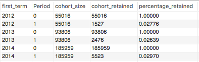

# E-commerce Analysis With MySQL Workbench And Tableau

## About the Data:

Maven Fuzzy Factory is a fictional toy company that operates an online shop. The Database has six tables, providing information about the user's website sessions, which pages were visited, their orders, the company's products, the items ordered, and the items refunded. 

Tables are: Orders, Order_items, Order_item_refunds, Products, Website_page_views, Website_sessions). 

### Entity Relation Diagram: 
 

### You can find the Database  [Here](https://www.kaggle.com/datasets/lenhatnam2810/mavenfuzzyfactory)

### For importing the database into MySQL workbench we have used the DDL Statements in [maven_ddl.sql](https://github.com/mervat-khaled/E-commerce-Analysis/blob/main/maven_ddl.sql) 

# GOAL
Analyze customer behavior, products, and the company's overall performance since the website launched in March 2012 to 2014. we excluded 2015  from our analysis because it only has the first quarter. 

# Tools Used
MySQL Workbench for the querying of the data.
Tableau for the visualization.

# Contents:
* Company overall performance
* Customer Behavior Analysis
* Product Analysis

## 1- Overall Performance 
* Question(1): Is there a steady growth between sessions and orders over time? And is there a seasonal trend?
```sql
SELECT  YEAR(ws.created_at) as year,quarter(ws.created_at) as quarter, ROUND(COUNT(DISTINCT ws.website_session_id),-3)as number_of_sessions,

ROUND(COUNT(DISTINCT o.order_id),-2) as number_of_orders
FROM website_sessions ws
LEFT JOIN orders o ON o.website_session_id = ws.website_session_id
where YEAR(ws.created_at) != 2015 
GROUP BY 1,2
ORDER BY 1;
```


#### There is a steady increase in the number of sessions and orders. And the graph shows the significant turnover rate in the 4th quarter of the year, and this seems logical because of the nature of the products themselves and as a result of the holidays/end of the year sales. 

* Question(2): To quantify the company's growth more, We need to check Revenue, Converstion Rate, and Gross Profit Margin.
  
```sql
SELECT 
    YEAR(ws.created_at) AS year,
    quarter(ws.created_at) as quarter,
    ROUND(SUM(o.price_usd),-3) AS total_revenue,
    ROUND(COUNT(DISTINCT o.order_id) / 
              COUNT(DISTINCT ws.website_session_id) *100,2 )as conversion_rate
FROM
    website_sessions ws
        LEFT JOIN
    orders o ON ws.website_session_id = o.website_session_idutm_content
    WHERE YEAR(ws.created_at) != 2015
GROUP BY 1,2
ORDER BY min(ws.created_at) 
;
SELECT 
     year,
(total_sales - total_cost) * 100 / total_sales as Gross_Profit_Margin
     
     
FROM
    (SELECT YEAR(created_at) AS year,SUM(items_purchased*cogs_usd) as total_cost,
    SUM(items_purchased * price_usd) as total_sales
    FROM orders
  group by 1 )  as a
WHERE year != 2015
;
```


#### All Metrics (Conversion Rate & Gross profit margin) are improving over time. Reaching a conversion rate from 3% to 8% indicates that the website is effectively converting visitors into customers, also 61% to 63% gross profit margin is generally considered very good in the context of e-commerce.

* Question(3): From which source do we have the most traffic? And from which campaigns we have the most customers? 
  

#### Most of the traffic came from Google search, and most of the orders too. Most of our customers came from Non-Brand campaigns, to complete the image of that insight we want to compare the conversion rate for each campaign.
```sql
SELECT  YEAR(ws.created_at) as year ,utm_campaign AS Campaigns, 
ROUND(COUNT(DISTINCT o.order_id) / 
              COUNT(DISTINCT ws.website_session_id) *100,2 )as conversion_rate
FROM website_sessions ws
LEFT JOIN orders o ON o.website_session_id = ws.website_session_id
where YEAR(ws.created_at) != 2015 AND utm_campaign  IN ('nonbrand','brand')
GROUP BY 1,2
ORDER BY 1;
```


#### Even though the acquisition of most customers came from Non-brand campaigns, customers from brand campaigns are most likely to buy a product, perhaps because branded campaigns focus on driving traffic through searches that include a company's brand name or specific product names, indicating a user's familiarity and intent to purchase.

# 2- Customer Behavior Analysis
 ### In this analysis, we will try to answer the question Of where potential customers come from.
## 1-  Customer Retention Rate: User Engagement Based On First Session.
```sql
SELECT first_term,
Period,
first_value(cohort_retained) over (partition by first_term order by period) as cohort_size,
cohort_retained,
cohort_retained *1.0  / 
first_value(cohort_retained) over (partition by first_term order by period) as percentage_retained
FROM(SELECT a.first_term, Coalesce(a.end_term - a.first_term,0) AS Period,
            COUNT(DISTINCT a.user_id) AS cohort_retained
FROM(
 SELECT user_id, min(YEAR(created_at)) as first_term,
                               max(YEAR(created_at)) as end_term
 
            FROM website_sessions
            GROUP BY 1) a
JOIN website_sessions b on a.user_id = b.user_id
WHERE first_term != 2015
GROUP BY 1,2
            )aa
;
```

 
